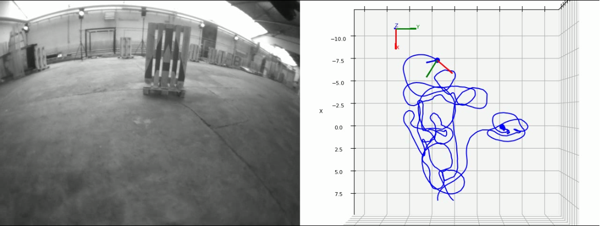
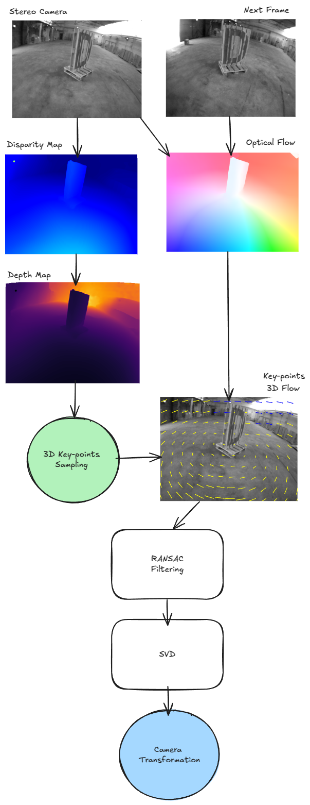

# Flight Path

  

Flight Path is a modular, Python-based visual odometry project that combines state-of-the-art deep learning techniques with classical geometry. It integrates RAFT-based optical flow and stereo disparity methods with SVD-based camera pose estimation (via the Kabsch algorithm). My little R&D in autonomous navigation and computer vision.

## Pipeline

  

## Datsets
Original datasets https://fpv.ifi.uzh.ch/datasets-backup/
